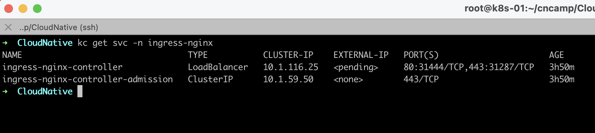
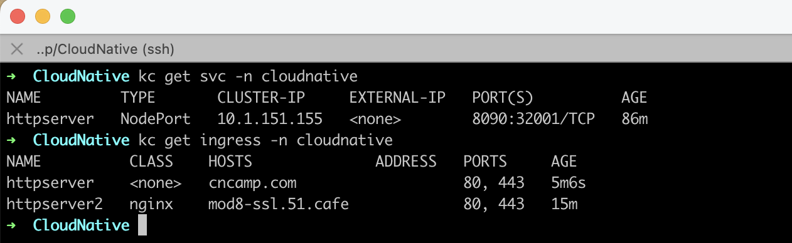
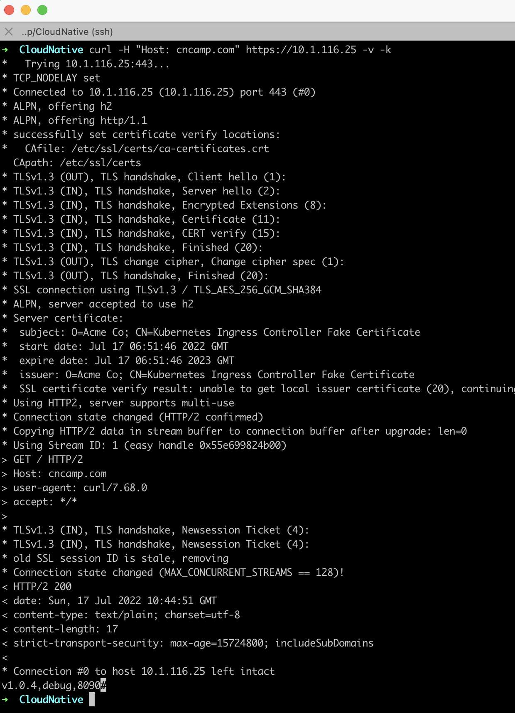
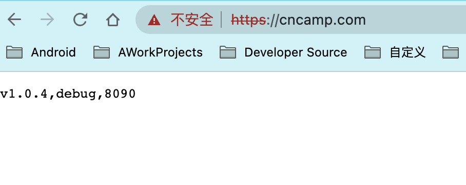
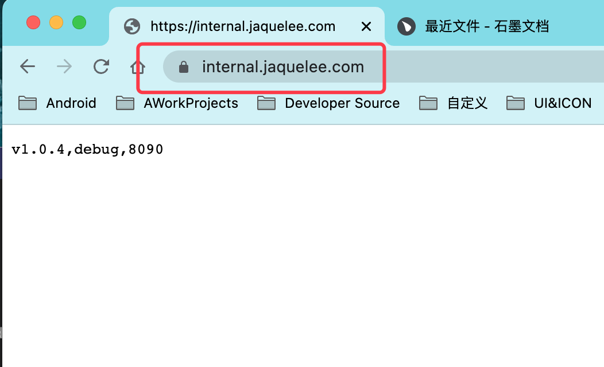

# CloudNative

# 第四次作业

## 基于 Service 通过 nodePort 提供对外访问的端口

```Yaml
apiVersion: v1
kind: Service
metadata:
  name: httpserver
  namespace: cloudnative
  labels:
    k8s-app: cloudnative
    cloudnative/name: cloudnative
spec:
  ports:
  - name: httpserver
    port: 8090
    protocol: TCP
    targetPort: 8090
    nodePort: 32001
  selector:
    k8s-app: cloudnative
    cloudnative/name: cloudnative
  type: NodePort
```

## 基于 ingress-nignx

- 1、ingress 部署文件见 ./ingress/deploy_1.3.0.yaml 镜像采用 registry 搭建的私有非加密仓库
- 2、创建 证书

```sh
openssl req -x509 -nodes -days 365 -newkey rsa:2048 -keyout tls.key -out tls.crt -subj "/CN=cncamp.com/O=cncamp" -addext "subjectAltName = DNS:cncamp.com"
```

- 3、创建 secret

```sh
kubectl create secret tls cncamp-tls --cert=./tls.crt --key=./tls.key
```

- 4、创建 ingress

```Yaml
apiVersion: networking.k8s.io/v1
kind: Ingress
metadata:
  name: httpserver
  namespace: cloudnative
  annotations:
    kubernetes.io/ingress.class: "nginx"
spec:
  tls:
    - hosts:
        - cncamp.com
      secretName: cncamp-tls
  rules:
    - host: cncamp.com
      http:
        paths:
          - path: "/"
            pathType: Prefix
            backend:
              service:
                name: httpserver
                port:
                  number: 8090
```

- 5 结果演示

  

  

  

- 配置好虚拟机和本机的 /etc/hosts 之后 可以通过浏览器打开接口 效果如下

  

## ingress-nignx 实战

- 1. 在 [dnspod](https://www.dnspod.cn/) 中为 域名 internal.jaquelee.com 配置 dns 解析，记录值为虚拟机 ip 172.16.201.6 172.16.201.7 172.16.201.8, 配置合适的 权重

- 2. 在 域名注册厂商申请免费的证书，只下载 其他类型的证书文件，将 crt 和 key 导入虚拟机中创建 secret

- 3. 创建 ingress 指向 cloudnative 对应的 service

```Yaml
apiVersion: networking.k8s.io/v1
kind: Ingress
metadata:
  name: httpserver
  namespace: cloudnative
  annotations:
    kubernetes.io/ingress.class: "nginx"
spec:
  tls:
    - hosts:
        - internal.jaquelee.com
      secretName: internal-rtsl
  rules:
    - host: internal.jaquelee.com
      http:
        paths:
          - path: "/"
            pathType: Prefix
            backend:
              service:
                name: httpserver
                port:
                  number: 8090
```

- 4. 在浏览器端打开 https://internal.jaquelee.com/ 可以正常访问【不需要在虚拟机和主机的 hosts 中做映射】

  

## 完整的服务部署文件见 deployment.yml
