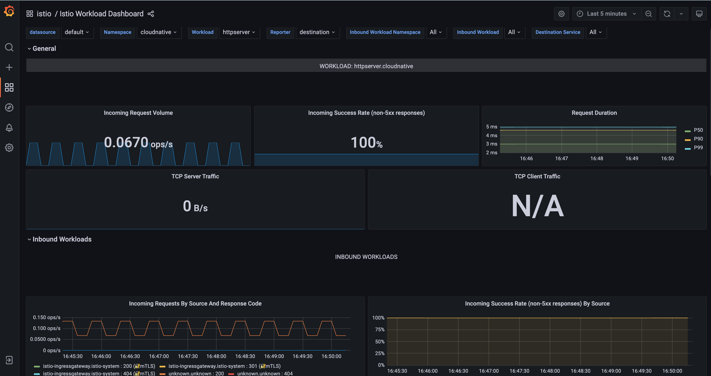

# CloudNative

# 第六次作业 istio

- 安装 istio

```sh
curl -L https://istio.io/downloadIstio | sh -
cd istio-1.14.3
cp bin/istioctl /usr/local/bin
istioctl install --set profile=demo -y
```

安装过程中出现镜像加载失败问题时 先在本地【走代理】把镜像拉取下来之后推到私有仓库，之后到 pod 运行的节点将私有仓库的镜像拉取下来，edit 对应的 pod 修改镜像 tag 可以加速部署速度，同时发现只要从自己的私有镜像仓库拉取镜像成功对应的原来的镜像 tag 也会存在。

- 给 http 服务所在的 namespace 打上标签 istio-injection=enabled 查看效果 kc get ns -L istio-injection

  

- 删除 cloudnative 中原先运行的 pod 新 pod 会立即重建 同时运行的容器数目由 1 变为了 2

  

- 查看 cloudnative 的 service

  

- 查看 istio-system 的 service 确认 istio-ingressgateway 的 service ip 为 【10.1.239.157】

  

- 在 cloudnative 部署 gateway && virtualservice【http】

```yaml
apiVersion: networking.istio.io/v1beta1
kind: VirtualService
metadata:
  name: httpsserver2
  namespace: cloudnative
spec:
  hosts:
    - cloudnative.jaquelee.com
  gateways:
    - httpsserver2
  http:
    - match:
        - port: 80
      route:
        - destination:
            host: httpserver.cloudnative.svc.cluster.local
            port:
              number: 80
---
apiVersion: networking.istio.io/v1beta1
kind: Gateway
metadata:
  name: httpsserver2
  namespace: cloudnative
spec:
  selector:
    istio: ingressgateway
  servers:
    - hosts:
        - cloudnative.jaquelee.com
      port:
        number: 80
        name: http
        protocol: HTTP
```

### 结果验证

执行

```Shell
curl -H "Host: cloudnative.jaquelee.com" 10.1.239.157/healthz
```

得到如下结果


- 在 cloudnative 部署 gateway && virtualservice【https】【cloudnative-other-tls 】

```yaml
apiVersion: networking.istio.io/v1beta1
kind: VirtualService
metadata:
  name: httpserver1
  namespace: cloudnative
spec:
  hosts:
    - cloudnative.jaquelee.com
  gateways:
    - httpserver1-gw
  http:
    - match:
        - port: 443
      route:
        - destination:
            host: httpserver.cloudnative.svc.cluster.local
            port:
              number: 80
---
apiVersion: networking.istio.io/v1beta1
kind: Gateway
metadata:
  name: httpserver1-gw
  namespace: cloudnative
spec:
  selector:
    istio: ingressgateway
  servers:
    - hosts:
        - cloudnative.jaquelee.com
      port:
        name: https-default
        number: 443
        protocol: HTTPS
      tls:
        credentialName: cloudnative-other-tls
        mode: SIMPLE
```

### 结果验证

执行

```Shell
curl --resolve cloudnative.jaquelee.com:443:10.1.239.157 https://cloudnative.jaquelee.com/healthz -k
```

得到如下结果


- 观察 istio-ingressgateway 日志 kc logs istio-ingressgateway-58f4c4f77f-z87h9 -n istio-system -f


## ---- 公网云服务器部署提供对外访问 ----

- 编辑 istio-ingressgateway 的 Service 添加 externalIPs 为各节点的 ip

```Shell
kubectl edit  service istio-ingressgateway -n istio-system
```


- 通过浏览器访问 https://cloudnative.jaquelee.com/healthz 或 http://cloudnative.jaquelee.com/healthz
  

#### 访问打通 在 grafana 中可以观察到 对应的 service【httpserver.cloudnative.svc.cluster.local】 的监控数据




- 安装 jaeger 查看 tracing

### PS

- 同时安装了 nginx-ingress 和 istio 时 为了互不影响 nginx-ingress 的 externalIPs 和 istio-ingressgateway 的 externalIPs 错开两者代理的域名才能正常访问，这个正常吗？
