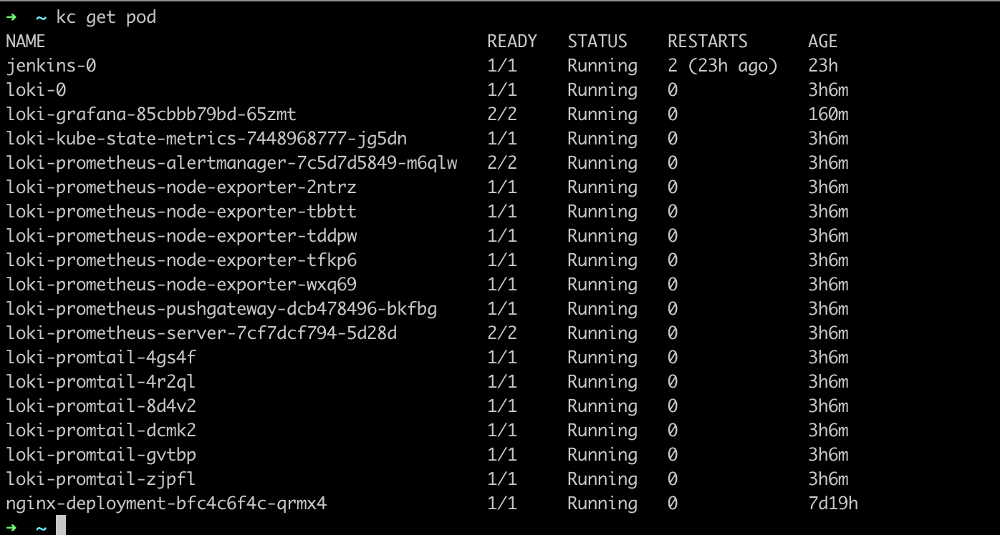
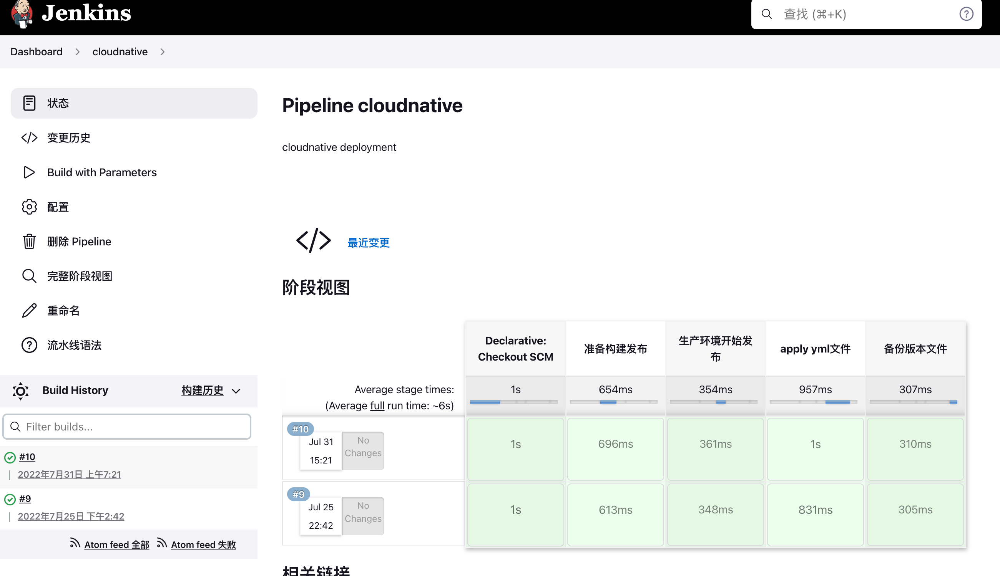
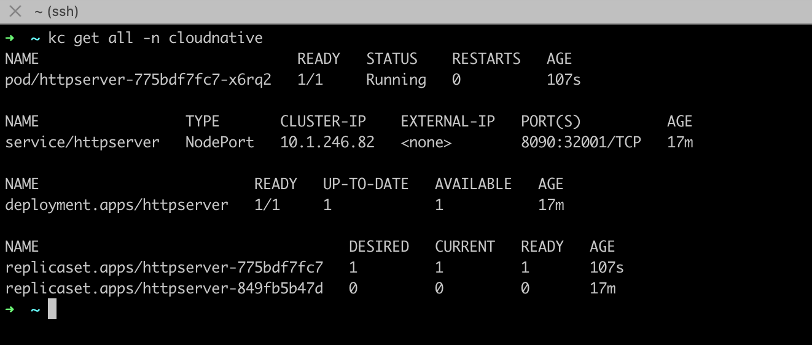
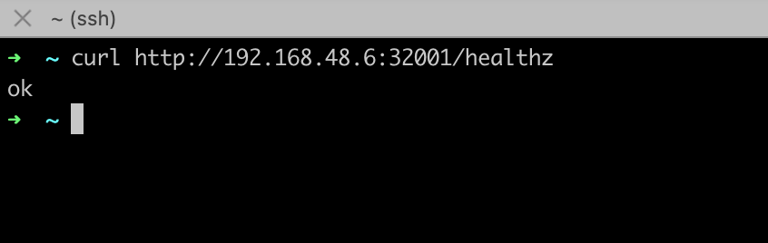
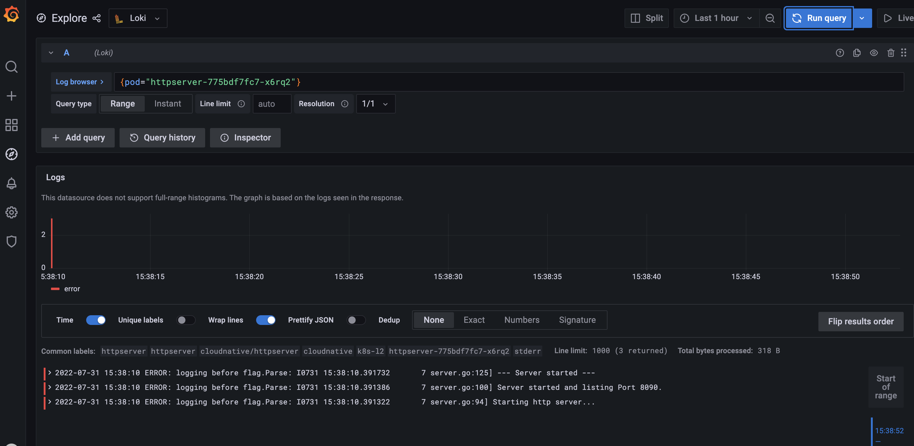
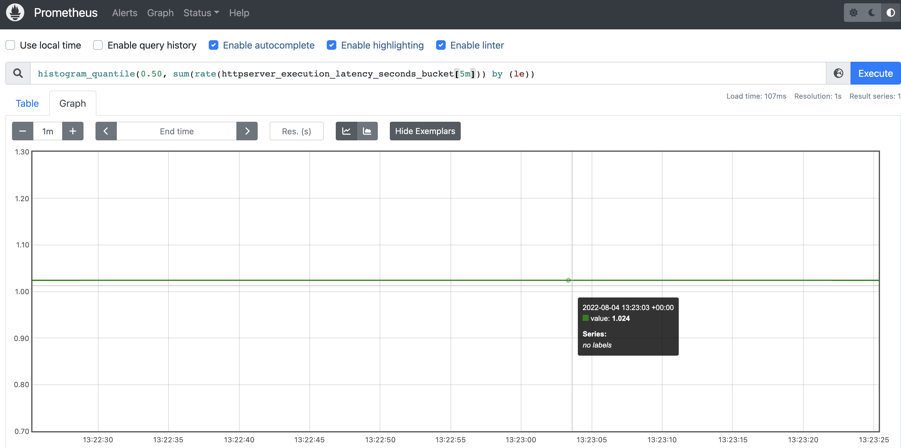
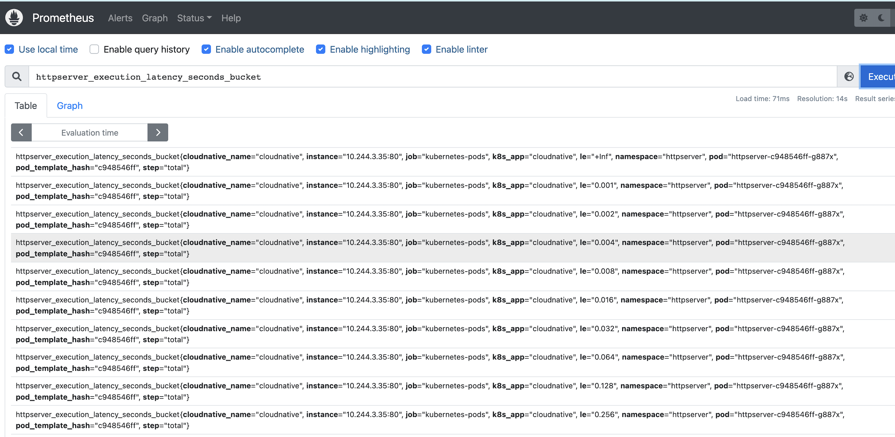
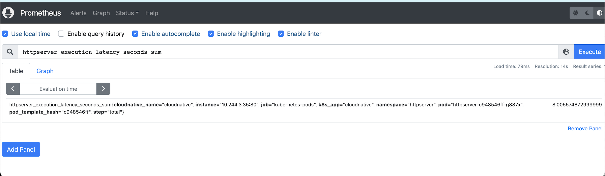
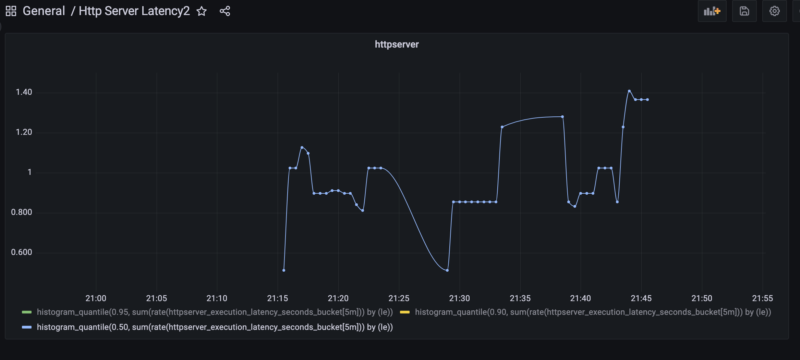

# CloudNative

# 第五次作业 Loki & grafana & prometheus

## 部署准备

- 部署 Loki & grafana & prometheus
  

- 在 服务中加响应的代码逻辑 同时完善服务终止的相关配置

- 构建新版本的镜像 版本号为：v1.0.7-metrics 直接执行 build.sh 完成构建和提交

- 通过 jenkins 的 pipline 来实现将项目部署到服务器上，jenkins 部署配置见
  [cloudnative-deploy](http://gitlab.jaquelee.com/jaquelee/cloudnative-deploy)

  

- 查看部署情况

  

  服务启动成功可以访问

  

## 验证 loki

- 验证 loki 日志收集

  

- 从 Promethus 界面中查询延时指标数据

  

  

  

## 设置 grafana dashboard

